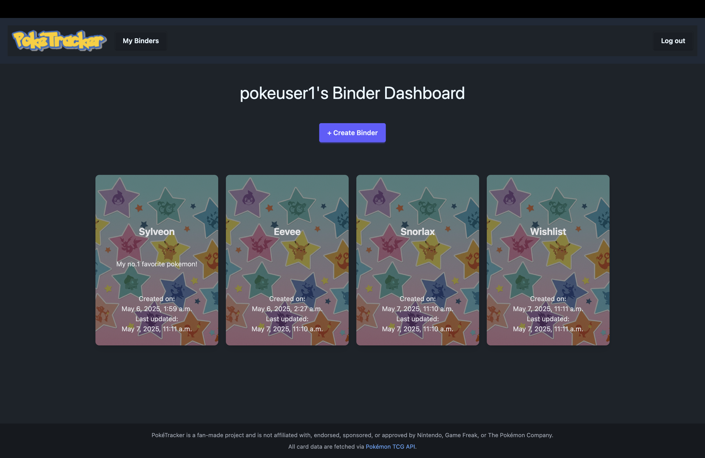
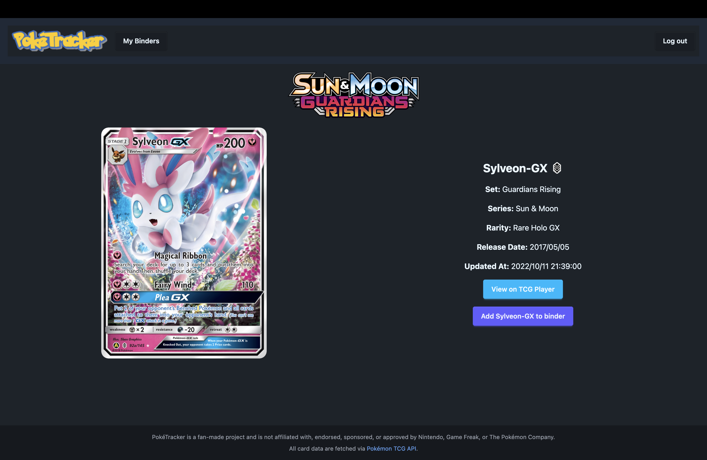
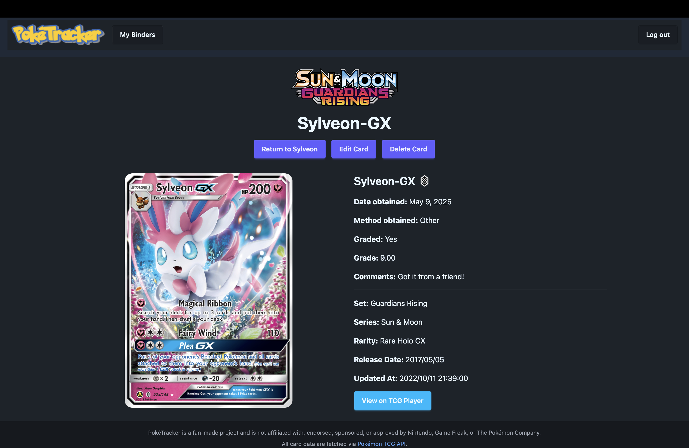
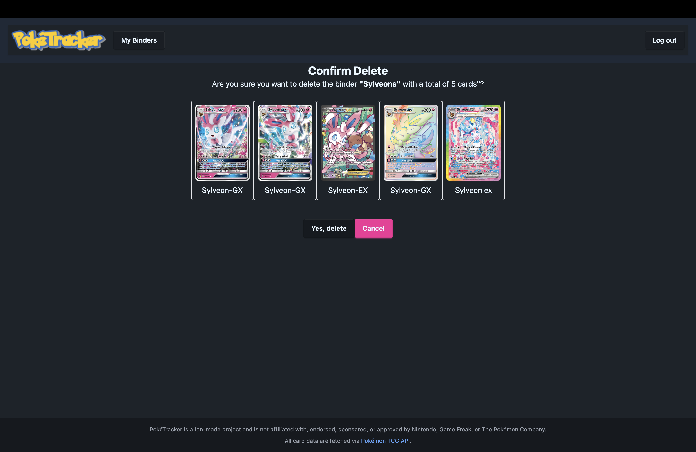

# PokéTracker
> A place to track and manage your Pokémon card collection.

---
# Background Info
My partner has always been an avid Pokémon card collector, and over the years, he's accumulated binders and binders of cards. I vividly remember him expressing frustration about the difficulty of keeping track of all the cards he owns, as well as managing prices for the ones on his wishlist.

This got me thinking that there might be a way to help solve these problems. I decided to try building an app with the idea of making it easier for collectors like him to organize and track their collections. The app is still a work in progress, but I hope it can eventually help not just him, but other Pokémon card enthusiasts as well! ☺️

## 🧠 About the App

This app is a work in progress designed to help Pokémon card collectors manage their collections more easily. It's built with the goal of simplifying the process of tracking cards, whether you're trying to organize what you own or keeping an eye on what you’re still looking to collect.

Currently, the app offers basic CRUD functionality:

**Create**: Create a binder and add new Pokémon cards to your collection, including details like the card's name, set, grade, how you obtained it, and other relevant information.

**Read**: View your collection and look through the cards you've added.

**Update**: Edit existing cards and binders in your collection, whether it's updating the condition or adding new details.

**Delete**: Remove cards and binders from your collection if you've traded them, sold them, or simply no longer want to track them.

---

## 🚀 Getting Started

### 🔗 Deployed App
- [PokéTracker](https://poketracker-edcf5dba71cb.herokuapp.com/)

### 🧾 Planning Materials
- [Trello Board](https://trello.com/b/njpmI5BB/poketracker)

---

## ⚙️ Technologies Used

- **Python 3.11**
- **Django**
- **PostgreSQL**
- **Tailwind CSS** (via CDN)
- **HTML**
- **Pokémon TCG API** – for card data and images
- **daisyUI** – custom CSS styling

---

## 📚 Attributions and References

- Pokémon data and images fetched from [Pokémon TCG API](https://pokemontcg.io/)
- Fonts: [Darumadrop One](https://fonts.google.com/specimen/Darumadrop+One)
- Icons: [Heroicons](https://heroicons.com/)
- Images: [Craiyon](https://www.craiyon.com/)
- Logo: [FontMeme](https://fontmeme.com/pokemon-font/)
- [Django Forms](https://docs.djangoproject.com/en/5.2/topics/forms/)
- [Django Paginator](https://docs.djangoproject.com/en/5.1/ref/paginator/)
- [DJango API Reference](https://docs.djangoproject.com/en/5.2/ref/)
---

## 🌱 Next Steps
- **Add sorting + filtering options**: Card number, series, most recently updated, set, etc.

- **Add grading company field:** I plan to include an option for users to specify the grading company (like PSA, SGC, etc.) when adding cards.

- **Enhance search functionality:** I want to allow users to search for cards based on criteria beyond just the Pokémon name. This could include searching by set, card number, or even card rarity.

- **Display prices:** A feature to display card prices is on the horizon. This will help users monitor the current value of their cards, making it easier to track investments or sales potential.

- **Show metrics on the user’s homepage:** I’m hoping to create a dashboard that provides users with key metrics, such as how many binders they own, how many cards they've collected from different sets, and other useful statistics.

- **Create multiple binder cover images:** I’d like to add the ability for users to choose from a selection of binder cover images. This will allow users to personalize their collections and make them feel more unique. It's still in the planning phase, but I think it would be a fun way to customize the user experience.
